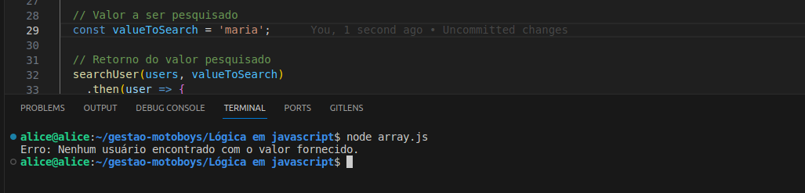
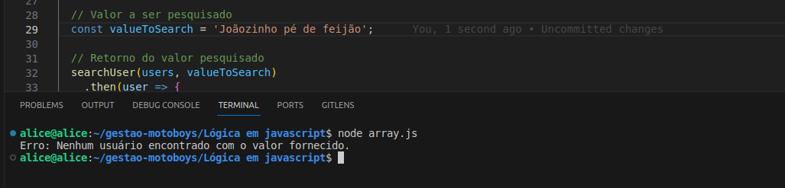
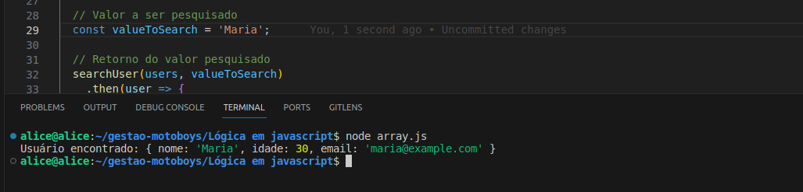

### Para este desafio, você precisará criar um código JavaScript que resolva a seguinte lógica:

- Receba um array de usuários contendo: nome, idade e email.
- Crie uma promise que receba o array de usuários e o valor que deseja pesquisar.
- Esta promise deve percorrer todos os usuários e retornar o primeiro que tenha o mesmo valor solicitado em alguma das propriedades.
- Se não encontrar nenhum dado, o código deve tratar um erro para cair no catch.
- Após coletar o resultado pesquisado no array, exiba esse usuário.

### Exemplos das saídas:

- Saída 1:
  

---

- Saída 2:

---

- Saída 3:
  

---

- Saída 4:
  

