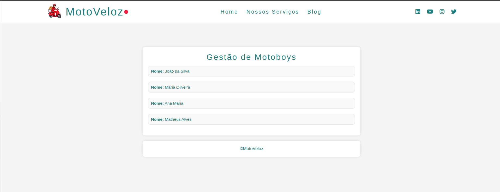

# 🏍️ MotoVeloz

---

## **Utilitários**

- Editor:  **[Visual Studio Code](https://code.visualstudio.com/)**  
- Ícones: **[Font Awesome](https://fontawesome.com/)**, **[Emoji para copiar](https://emojisparacopiar.com/)**
- Fontes:  **[Poppins](https://fonts.google.com/specimen/Poppins)**
- Paleta: **[Cores](https://paletadecores.com/paleta/ff1d44/fbebaf/74bf9d/56a292/1c8080/)**

---
